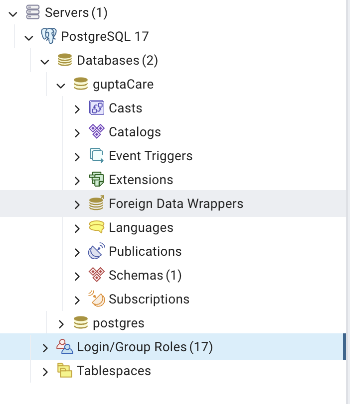
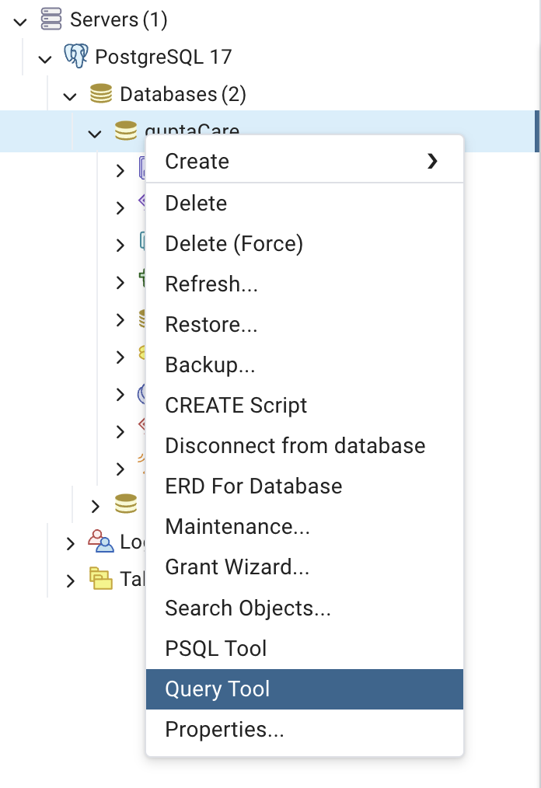

# Database Setup Instructions

To run the server locally, you first have to install postgreSQL. We used the youtube video below to install postgreSQL

    https://www.youtube.com/watch?v=-Dux6hnmWNE&ab_channel=JustAnotherDangHowToChannel

Next, you need to create a database. We followed the instructions in the youtube video below to register a server and create a database

    https://www.youtube.com/watch?v=2rqMRkVvXcw&t=221s&ab_channel=JustAnotherDangHowToChannel

You can name the database anything but you will need to use the database name later to connect to the backend. Now you need to create a new Login/Group Role for the database. Right click where it says Login/Group Roles and click create. 

Give the group a name under the `General` tab, password under the `Definition` tab, and mark it as a super user under the Privileges tab. Note down the name and password.

Now in `backend/database.py`

    # Database Config
    DB_CONFIG = {
        "dbname": "guptaCare",
        "user": "joshiMembers",
        "password": "joshiBoss",
        "host": "localhost",
        "port": 5432,
    }

Enter the database name, user, and password in the dbname, user, and password fields.

Now all you need to do is go to the query tool

and paste all the create table scripts in 

    CREATE_SCRIPTS.md

and execute these scripts.

Now the database should be all set.

# Backend Setup Instructions

NOTE: This needs to run on port 5000, so if there are existing apps using the port, you have to kill those apps. Otherwise the system will not work properly end to end.

In order to run the backend, you need to be in a python virtual environment. Furthermore, due to package versions, you need to have python 3.11 installed on your computer. Once you have python3.11 installed, go to the backend directory

    cd backend

and create the virtual environment.

    python3.11 -m venv .venv

You should see a newly created `.venv` directory in the backend folder. Now enter the virtual env by running 

    source .venv/bin/activate

Now you need to install all required packages by running 

    pip install -r requirements.txt

Once you have completed all of the above steps, you can run the backend file 

    python3.11 database.py

If there are package/module import errors, ensure that you're in the virtual env, and try deleting and reinstalling all packages by running the following commands.

    pip uninstall -r requirements.txt -y

    pip install -r requirements.txt

# Frontend Setup Instructions

NOTE: This needs to run on port 3000, so if there are existing apps using the port, you have to kill those apps. Otherwise the system will not work properly end to end.

For the frontend, the setup is relatively simple. All you need to do is go to the frontend directory

    cd frontend

and run 

    npm install

Once that finishes. You can run the front end by running

    npm run dev

# Running Unit Tests

We have two unit test suites. One tests the backend functions and the other tests some of the frontend functionality.

## Running backend tests

In order to run the backend tests, you have to be in a virtual environment. The instructions for creating and entering one are under the `Backend Setup Instructions` section.

Once you've entered the vitrual env, you need to go to the root directory of the project. Here you should see: 

    pytest.ini

Now you simply need to run 

    pytest tests

If there are issues, ensure that the virtual env has been setup correctly.

## Running frontend tests

In order to run the frontend tests, you have to have the setup for frontend done. Once you have the packages installed, you can go to the frontend directory

    cd frontend

and run the tests

    npm run test

If this doesn't work, ensure you have all the packages and that your node/npm are up to date